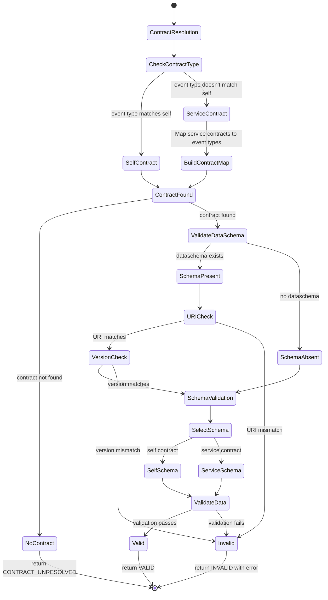

# Execution Diagrams for ArvoMachine

## `validateInput` method

This method checks if an incoming event is valid by ensuring it matches either the machine's own contract (init event) or one of its service contracts (emitted events). It first tries to find a matching contract, then checks if the event's dataschema and version information are correct, and finally validates the event's data structure. If anything goes wrong, it tells you what the problem was - otherwise it confirms the event is good to go.

