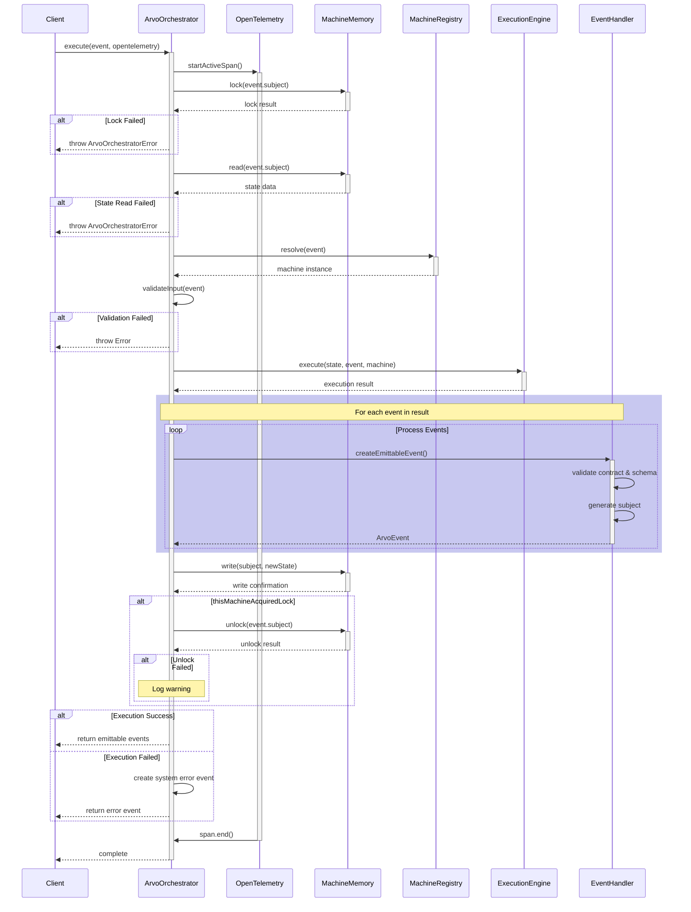

```mermaid
stateDiagram-v2
    [*] --> StartExecution
    StartExecution --> AcquireLock
    
    state AcquireLock {
        [*] --> TryLock
        TryLock --> LockSuccess: acquired
        TryLock --> LockError: failed
        LockError --> [*]: throw ArvoOrchestratorError
        LockSuccess --> [*]
    }
    
    AcquireLock --> AcquireState
    
    state AcquireState {
        [*] --> ReadMemory
        ReadMemory --> StateRead: success
        ReadMemory --> ReadError: failed
        ReadError --> [*]: throw ArvoOrchestratorError
        StateRead --> [*]
    }
    
    AcquireState --> ValidateAndExecute
    
    state ValidateAndExecute {
        [*] --> ValidateLockStatus
        ValidateLockStatus --> ValidateSubject: lock confirmed
        ValidateSubject --> ResolveMachine
        ResolveMachine --> ValidateEventInput
        ValidateEventInput --> ExecuteMachine: validation passed
        ValidateEventInput --> ValidationError: invalid input
        ValidationError --> [*]: throw Error
    }
    
    ValidateAndExecute --> ProcessExecution
    
    state ProcessExecution {
        [*] --> ExecuteStateMachine
        ExecuteStateMachine --> GenerateEvents
        GenerateEvents --> ProcessFinalOutput
        ProcessFinalOutput --> CreateEmittableEvents
    }
    
    state CreateEmittableEvents {
        [*] --> DetermineEventType
        DetermineEventType --> CompleteEvent: completion event
        DetermineEventType --> ServiceEvent: service event
        CompleteEvent --> ValidateEventData
        ServiceEvent --> ValidateEventData
        ValidateEventData --> CreateEvent
    }
    
    ProcessExecution --> UpdateState
    
    state UpdateState {
        [*] --> WriteMemory
        WriteMemory --> ReleaseLock
    }
    
    UpdateState --> Success: no errors
    UpdateState --> ErrorHandling: execution error
    
    state ErrorHandling {
        [*] --> LogError
        LogError --> CreateSystemErrorEvent
        CreateSystemErrorEvent --> [*]
    }
    
    Success --> [*]: return emittable events
    ErrorHandling --> [*]: return error event
```

```mermaid
sequenceDiagram
    participant C as Client
    participant O as ArvoOrchestrator
    participant OT as OpenTelemetry
    participant M as MachineMemory
    participant R as MachineRegistry
    participant E as ExecutionEngine
    participant EH as EventHandler

    C->>+O: execute(event, opentelemetry)
    O->>+OT: startActiveSpan()

    O->>+M: lock(event.subject)
    M-->>-O: lock result
    alt Lock Failed
        O-->>C: throw ArvoOrchestratorError
    end

    O->>+M: read(event.subject)
    M-->>-O: state data
    alt State Read Failed
        O-->>C: throw ArvoOrchestratorError
    end

    O->>+R: resolve(event)
    R-->>-O: machine instance

    O->>O: validateInput(event)
    alt Validation Failed
        O-->>C: throw Error
    end

    O->>+E: execute(state, event, machine)
    E-->>-O: execution result

    rect rgb(200, 200, 240)
        Note over O,EH: For each event in result
        loop Process Events
            O->>+EH: createEmittableEvent()
            EH->>EH: validate contract & schema
            EH->>EH: generate subject
            EH-->>-O: ArvoEvent
        end
    end

    O->>+M: write(subject, newState)
    M-->>-O: write confirmation

    alt thisMachineAcquiredLock
        O->>+M: unlock(event.subject)
        M-->>-O: unlock result
        alt Unlock Failed
            Note over O: Log warning
        end
    end

    alt Execution Success
        O-->>C: return emittable events
    else Execution Failed
        O->>O: create system error event
        O-->>C: return error event
    end

    OT->>-O: span.end()
    O-->>-C: complete
```
