# ArvoOrchestrator Technical Documentation

This technical documentation provides a comprehensive overview of the ArvoOrchestrator's event processing system, illustrating both the state transitions and component interactions that occur during event execution. Through detailed state and sequence diagrams, engineers can trace how events flow through the orchestrator, understand where and why different types of errors might occur, and identify the specific interactions between the Orchestrator, Memory, Registry, and ExecutionEngine components.

The documentation maps out the complete lifecycle of event processing, from initial validation through lock management, state handling, and eventual event emission, with particular attention to error scenarios and their propagation paths. Engineers working with this orchestrator can use these diagrams to understand the extensive validation checks, state management procedures, and error handling mechanisms that ensure reliable event processing.

### Key Components

#### ArvoOrchestrator
Main orchestration class that coordinates event processing through multiple subsystems. Manages the complete event lifecycle including validation, execution, and state persistence.

#### IMachineRegistry
Registry system that maintains collections of versioned state machines. Resolves appropriate machine instances based on orchestrator name and version extracted from event subjects.

#### IMachineExecutionEngine
Pluggable execution engine that manages XState machine lifecycle. Handles snapshot restoration, event sending, and collection of emitted events and final outputs.

#### ArvoMachine
Encapsulates XState logic with Arvo contracts. Provides input validation against configured contracts and metadata for event creation.

#### SyncEventResource
Resource management layer that handles distributed locking and state persistence. Ensures atomic operations across concurrent event processing.

## Execution Flow

The state diagram below illustrates the core execution flow and decision points:

```mermaid
stateDiagram-v2
    [*] --> StartExecution : Event received
    StartExecution --> ValidateSubject : Create OpenTelemetry span
    
    ValidateSubject --> SubjectMismatch : Wrong orchestrator name
    ValidateSubject --> ResolveMachine : Subject valid
    
    SubjectMismatch --> ReturnEmpty : Log warning
    ReturnEmpty --> [*]
    
    ResolveMachine --> MachineNotFound : No machine for version
    ResolveMachine --> ValidateInput : Machine resolved
    
    MachineNotFound --> ThrowConfigViolation
    ThrowConfigViolation --> ErrorHandling
    
    ValidateInput --> ContractUnresolved : No matching contract
    ValidateInput --> InvalidData : Schema/data validation fails
    ValidateInput --> AcquireLock : Input valid
    
    ContractUnresolved --> ThrowConfigViolation
    InvalidData --> ThrowContractViolation
    ThrowContractViolation --> ErrorHandling
    
    AcquireLock --> LockNotAcquired : Lock unavailable
    AcquireLock --> AcquireState : Lock acquired/not required
    
    LockNotAcquired --> ThrowTransactionViolation
    ThrowTransactionViolation --> ErrorHandling
    
    AcquireState --> CheckInitialization : State loaded/initialized
    
    CheckInitialization --> InvalidInitEvent : No state but wrong event type
    CheckInitialization --> ExecuteMachine : Valid init or resume
    
    InvalidInitEvent --> ReturnEmpty : Log invalid initialization
    
    ExecuteMachine --> ProcessResults : Machine execution complete
    ExecuteMachine --> MachineError : Machine throws error
    
    MachineError --> ErrorHandling
    
    ProcessResults --> CreateEvents : Process machine events + final output
    CreateEvents --> EventCreationFailed : Schema validation fails
    CreateEvents --> PersistState : Events created successfully
    
    EventCreationFailed --> ErrorHandling
    
    PersistState --> ReleaseLock : State persisted
    ReleaseLock --> ReturnEvents : Lock released
    ReturnEvents --> [*] : Return domained events
    
    ErrorHandling --> ViolationError : Check error type
    ErrorHandling --> SystemError : Runtime/workflow error
    
    ViolationError --> RethrowError : ConfigViolation, etc.
    RethrowError --> [*]
    
    SystemError --> CreateSystemError : Create error event
    CreateSystemError --> ReleaseLock : System error created

    state ValidateInput {
        [*] --> CallMachineValidation : machine.validateInput(event)
        CallMachineValidation --> CheckValidationResult
        
        CheckValidationResult --> Valid : type === 'VALID'
        CheckValidationResult --> ContractUnresolved : type === 'CONTRACT_UNRESOLVED'
        CheckValidationResult --> InvalidContract : type === 'INVALID'
        CheckValidationResult --> InvalidData : type === 'INVALID_DATA'
        
        Valid --> [*]
        ContractUnresolved --> [*]
        InvalidContract --> [*]
        InvalidData --> [*]
    }

    state ResolveMachine {
        [*] --> ParseSubject : ArvoOrchestrationSubject.parse()
        ParseSubject --> CallRegistryResolve : registry.resolve(event)
        CallRegistryResolve --> CheckMachineResult
        
        CheckMachineResult --> MachineFound : Machine returned
        CheckMachineResult --> NoMachine : null returned
        
        MachineFound --> [*]
        NoMachine --> [*]
    }

    state ExecuteMachine {
        [*] --> PrepareExecution : Extract parentSubject from init event
        PrepareExecution --> CallExecutionEngine : executionEngine.execute()
        CallExecutionEngine --> ProcessMachineResult
        
        ProcessMachineResult --> CheckFinalOutput : Execution complete
        CheckFinalOutput --> AddFinalOutput : finalOutput exists
        CheckFinalOutput --> ProcessRawEvents : No final output
        
        AddFinalOutput --> CreateCompleteEvent : Add complete event to raw events
        CreateCompleteEvent --> ProcessRawEvents
        ProcessRawEvents --> [*] : Raw events ready
    }

    state CreateEvents {
        [*] --> InitializeEventMaps : Create domains, emittables, eventIdMap
        InitializeEventMaps --> ProcessRawEvents : For each raw machine event
        
        ProcessRawEvents --> CreateEmittableEvent : Process event
        CreateEmittableEvent --> ValidateEventContract : Resolve contract for event
        ValidateEventContract --> CheckEventType : Contract found
        ValidateEventContract --> EventValidationFailed : No contract
        
        CheckEventType --> HandleCompleteEvent : Complete event type
        CheckEventType --> HandleServiceEvent : Service event type
        
        HandleCompleteEvent --> SetCompleteSubject : Use parent or current subject
        SetCompleteSubject --> SetCompleteParentId : Use initEventId
        SetCompleteParentId --> FinalizeEvent
        
        HandleServiceEvent --> CheckOrchestratorType : Check if orchestrator contract
        CheckOrchestratorType --> HandleOrchestratorChaining : ArvoOrchestratorContract
        CheckOrchestratorType --> HandleRegularService : Regular service
        
        HandleOrchestratorChaining --> ValidateParentSubject : Check parentSubject$$
        ValidateParentSubject --> CreateOrchestratorSubject : Valid/missing parent
        ValidateParentSubject --> ParentSubjectError : Invalid parent
        
        CreateOrchestratorSubject --> CreateFromParent : parentSubject$$ exists
        CreateOrchestratorSubject --> CreateNew : No parentSubject$$
        CreateFromParent --> FinalizeEvent
        CreateNew --> FinalizeEvent
        
        HandleRegularService --> FinalizeEvent
        
        FinalizeEvent --> ValidateEventData : Schema validation
        ValidateEventData --> CreateArvoEvent : Data valid
        ValidateEventData --> SchemaValidationFailed : Invalid data
        
        CreateArvoEvent --> AddToEmittables : Event created
        AddToEmittables --> OrganizeByDomains : Add to domain buckets
        OrganizeByDomains --> CheckMoreEvents : More events to process
        CheckMoreEvents --> ProcessRawEvents : Has more
        CheckMoreEvents --> AddOtelAttributes : All processed
        
        AddOtelAttributes --> [*] : Events ready
        
        EventValidationFailed --> [*]
        ParentSubjectError --> [*]
        SchemaValidationFailed --> [*]
    }

    state CheckInitialization {
        [*] --> CheckStateExists : state loaded?
        CheckStateExists --> NewWorkflow : state === null
        CheckStateExists --> ExistingWorkflow : state exists
        
        NewWorkflow --> ValidateInitEventType : event.type === this.source?
        ValidateInitEventType --> ValidInit : Types match
        ValidateInitEventType --> InvalidInit : Types don't match
        
        ValidInit --> ExtractParentSubject : Get parentSubject$$ from event.data
        ExtractParentSubject --> [*]
        
        InvalidInit --> [*]
        ExistingWorkflow --> [*]
    }

    state PersistState {
        [*] --> BuildEventTracking : Create event tracking object
        BuildEventTracking --> SetConsumedEvent : Set consumed event
        SetConsumedEvent --> CreateProducedMap : Build produced events map
        CreateProducedMap --> BuildNewState : Combine all state data
        BuildNewState --> WriteToMemory : syncEventResource.persistState()
        WriteToMemory --> [*] : State persisted
    }

    state CreateSystemError {
        [*] --> ParseSubjectForError : Try to parse event subject
        ParseSubjectForError --> CreateErrorEvent : Subject parsed/failed
        CreateErrorEvent --> SetErrorTarget : Route to initiator/source
        SetErrorTarget --> SetErrorSubject : Use parent or current subject
        SetErrorSubject --> SetErrorParentId : Use initEventId or event.id
        SetErrorParentId --> AddErrorOtelAttributes : Set telemetry attributes
        AddErrorOtelAttributes --> [*] : System error ready
    }
```

## Component Interactions

The sequence diagram below shows the detailed interactions between components during event processing:

```mermaid
sequenceDiagram
    participant Client
    participant ArvoOrchestrator as ArvoOrchestrator
    participant OTel as OpenTelemetry
    participant SyncResource as SyncEventResource
    participant Memory as IMachineMemory
    participant Registry as IMachineRegistry
    participant Machine as ArvoMachine
    participant ExecutionEngine as IMachineExecutionEngine
    participant EventFactory as EventFactory

    Client->>ArvoOrchestrator: execute(event, opentelemetry)
    
    ArvoOrchestrator->>OTel: startActiveSpan()
    OTel-->>ArvoOrchestrator: span created
    
    Note over ArvoOrchestrator: Subject & Machine Resolution
    ArvoOrchestrator->>SyncResource: validateEventSubject(event, span)
    ArvoOrchestrator->>ArvoOrchestrator: ArvoOrchestrationSubject.parse()
    
    alt Wrong orchestrator name
        ArvoOrchestrator->>OTel: logToSpan(WARNING)
        ArvoOrchestrator-->>Client: return empty events
    end
    
    ArvoOrchestrator->>Registry: resolve(event, {inheritFrom: 'CONTEXT'})
    Registry->>Registry: match version from subject
    Registry-->>ArvoOrchestrator: machine or null
    
    alt Machine not found
        ArvoOrchestrator->>ArvoOrchestrator: throw ConfigViolation
    end
    
    Note over ArvoOrchestrator: Input Validation
    ArvoOrchestrator->>Machine: validateInput(event)
    
    Machine->>Machine: resolve contract (self/service)
    Machine->>Machine: validate dataschema & URI
    Machine->>Machine: schema.parse(event.data)
    Machine-->>ArvoOrchestrator: validation result
    
    alt Contract unresolved
        ArvoOrchestrator->>ArvoOrchestrator: throw ConfigViolation
    end
    
    alt Invalid data or contract
        ArvoOrchestrator->>ArvoOrchestrator: throw ContractViolation
    end
    
    Note over ArvoOrchestrator: Resource Locking
    ArvoOrchestrator->>SyncResource: acquireLock(event, span)
    SyncResource->>Memory: attempt lock acquisition
    Memory-->>SyncResource: lock status
    SyncResource-->>ArvoOrchestrator: ACQUIRED/NOT_ACQUIRED/NOT_REQUIRED
    
    alt Lock not acquired
        ArvoOrchestrator->>ArvoOrchestrator: throw TransactionViolation
    end
    
    Note over ArvoOrchestrator: State Management
    ArvoOrchestrator->>SyncResource: acquireState(event, span)
    SyncResource->>Memory: read(event.subject)
    Memory-->>SyncResource: existing state or null
    SyncResource-->>ArvoOrchestrator: machine memory record
    
    alt New workflow with wrong event type
        ArvoOrchestrator->>OTel: logToSpan(WARNING - invalid init)
        ArvoOrchestrator->>SyncResource: releaseLock()
        ArvoOrchestrator-->>Client: return empty events
    end
    
    Note over ArvoOrchestrator: Machine Execution
    ArvoOrchestrator->>ArvoOrchestrator: extract parentSubject from init event
    
    ArvoOrchestrator->>ExecutionEngine: execute({state, event, machine}, {inheritFrom: 'CONTEXT'})
    ExecutionEngine->>ExecutionEngine: restore XState snapshot
    ExecutionEngine->>ExecutionEngine: send event to machine
    ExecutionEngine->>ExecutionEngine: collect emitted events
    ExecutionEngine->>ExecutionEngine: get final output if done
    ExecutionEngine-->>ArvoOrchestrator: {state, events, finalOutput?}
    
    ArvoOrchestrator->>OTel: setAttribute('arvo.orchestration.status', status)
    
    Note over ArvoOrchestrator: Event Processing
    ArvoOrchestrator->>ArvoOrchestrator: collect raw machine events
    
    alt Has final output
        ArvoOrchestrator->>ArvoOrchestrator: add complete event to raw events
        ArvoOrchestrator->>ArvoOrchestrator: set target = redirectto ?? initiator
    end
    
    loop For each raw machine event
        ArvoOrchestrator->>ArvoOrchestrator: createEmittableEvent()
        
        alt Complete Event
            ArvoOrchestrator->>ArvoOrchestrator: resolve self contract
            ArvoOrchestrator->>ArvoOrchestrator: set subject = parentSubject ?? current
            ArvoOrchestrator->>ArvoOrchestrator: set parentId = initEventId
        else Service Event
            ArvoOrchestrator->>ArvoOrchestrator: resolve service contract
            
            alt Orchestrator Contract
                ArvoOrchestrator->>ArvoOrchestrator: validate parentSubject$$
                ArvoOrchestrator->>ArvoOrchestrator: ArvoOrchestrationSubject.from/new()
            end
            
            ArvoOrchestrator->>ArvoOrchestrator: validate event data against schema
        end
        
        ArvoOrchestrator->>EventFactory: createArvoEvent(eventParams)
        EventFactory-->>ArvoOrchestrator: created event
        
        ArvoOrchestrator->>ArvoOrchestrator: organize by domains
        ArvoOrchestrator->>OTel: setAttribute(event telemetry)
    end
    
    Note over ArvoOrchestrator: State Persistence
    ArvoOrchestrator->>ArvoOrchestrator: build event tracking state
    ArvoOrchestrator->>ArvoOrchestrator: prepare machine memory record
    
    ArvoOrchestrator->>SyncResource: persistState(event, newState, oldState, span)
    SyncResource->>Memory: write(subject, machineMemoryRecord)
    Memory-->>SyncResource: write success
    SyncResource-->>ArvoOrchestrator: persistence complete
    
    ArvoOrchestrator->>OTel: logToSpan(INFO - execution complete)
    
    Note over ArvoOrchestrator: Cleanup & Return
    ArvoOrchestrator->>SyncResource: releaseLock(event, acquiredLock, span)
    SyncResource->>Memory: release lock if acquired
    ArvoOrchestrator->>OTel: span.end()
    
    ArvoOrchestrator-->>Client: {events, allEventDomains, domainedEvents}

    Note over ArvoOrchestrator: Error Handling Path
    rect rgb(255, 200, 200)
        alt ViolationError (Config/Contract/Execution)
            ArvoOrchestrator->>OTel: logToSpan(CRITICAL)
            ArvoOrchestrator->>OTel: exceptionToSpan(error)
            ArvoOrchestrator->>SyncResource: releaseLock()
            ArvoOrchestrator->>ArvoOrchestrator: throw error (rethrow)
        else Runtime/Workflow Error
            ArvoOrchestrator->>OTel: logToSpan(ERROR)
            ArvoOrchestrator->>OTel: exceptionToSpan(error)
            
            ArvoOrchestrator->>ArvoOrchestrator: parse event subject for routing
            ArvoOrchestrator->>EventFactory: createSystemError({source, subject, to, error, ...})
            EventFactory-->>ArvoOrchestrator: system error event
            
            ArvoOrchestrator->>OTel: setAttribute(error event telemetry)
            ArvoOrchestrator->>SyncResource: releaseLock()
            ArvoOrchestrator-->>Client: {events: [errorEvent], domains: ['default']}
        end
    end
```

