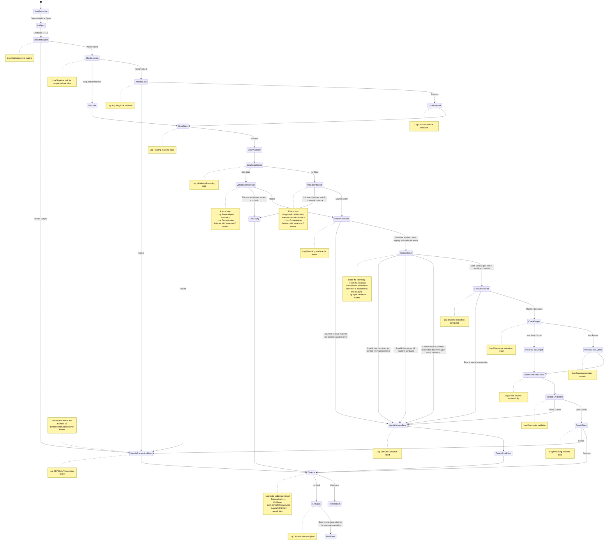
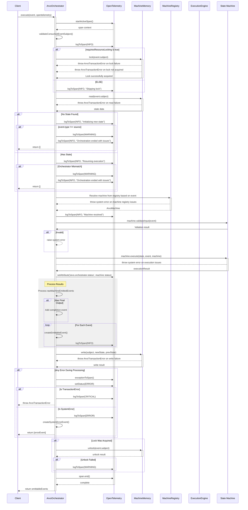

# ArvoOrchestrator Technical Documentation

The ArvoOrchestrator is a critical component that orchestrates state machine execution and lifecycle management. It handles machine resolution, state management, event processing, and error handling while maintaining comprehensive telemetry through OpenTelemetry integration.

## Core Responsibilities

The orchestrator manages several key aspects:

1. State machine lifecycle management
2. Lock acquisition and state management
3. Event validation and processing
4. Machine resolution and execution
5. Error handling and cleanup
6. Event emission and routing

## Execution Flow

The state diagram below illustrates the core execution flow:

## Component Interactions

The sequence diagram below shows the detailed interactions between components:

## Detailed Phase Descriptions

The ArvoOrchestrator execution process begins with span management, where it creates OpenTelemetry producer spans and establishes proper telemetry context. This is followed by the critical lock and state management phase, where it acquires exclusive locks on subjects, retrieves current machine states, and validates subject formats. The machine processing phase then resolves appropriate versions, validates inputs against contracts, and prepares machines for execution.

Once initial setup is complete, the orchestrator moves into event processing, where it executes machine logic, creates and validates emittable events, updates machine states, and handles event routing. Error handling runs parallel to all phases, creating system error events when needed, ensuring proper resource cleanup, maintaining telemetry context, and returning appropriate error responses. The orchestrator implements robust state management through exclusive locking mechanisms, persistent storage, and careful validation.

Throughout the entire process, the orchestrator maintains comprehensive telemetry integration via OpenTelemetry, providing detailed execution attributes and resource usage metrics. It enforces strict schema validation and contract enforcement for all events, generates appropriate subjects, and ensures proper event routing and completion notification. This comprehensive approach ensures reliable state machine orchestration while maintaining observability and proper error handling throughout the execution lifecycle.
