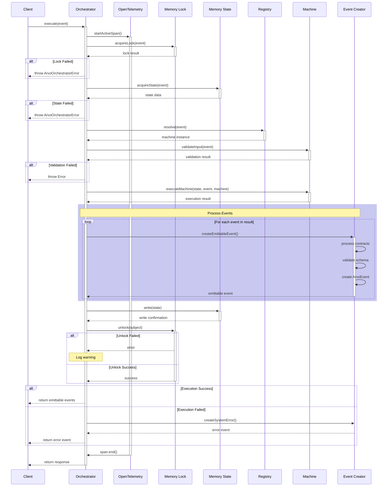

```mermaid
stateDiagram-v2
   [*] --> BeginExecution
   BeginExecution --> AcquireLock
   
   state AcquireLock {
       [*] --> AttemptLock
       AttemptLock --> LockSuccess: lock acquired
       AttemptLock --> LockFailure: error
       LockFailure --> [*]: throw error
       LockSuccess --> [*]
   }

   state AcquireState {
       [*] --> ReadState
       ReadState --> StateSuccess: state read
       ReadState --> StateFailure: error
       StateFailure --> [*]: throw error
       StateSuccess --> [*]
   }

   AcquireLock --> AcquireState
   AcquireState --> ValidateExecution

   state ValidateExecution {
       [*] --> CheckLockStatus
       CheckLockStatus --> LockValid: lock acquired
       CheckLockStatus --> ThrowLockError: lock not acquired
       LockValid --> ResolveEventType
       ResolveEventType --> ResolveMachine
       ResolveMachine --> ValidateInput
       ValidateInput --> ValidationSuccess: valid
       ValidateInput --> ValidationFailure: invalid
       ValidationFailure --> ThrowValidationError
       ThrowValidationError --> [*]
       ValidationSuccess --> [*]
   }

   ValidateExecution --> ExecuteMachine
   
   state ExecuteMachine {
       [*] --> ProcessState
       ProcessState --> WriteState
       WriteState --> UnlockMemory
       UnlockMemory --> HandleEvents
   }

   state HandleEvents {
       [*] --> PrepareEvents
       PrepareEvents --> CreateEmittableEvents
       CreateEmittableEvents --> ProcessEmittables
   }

   state CreateEmittableEvents {
       [*] --> ProcessContract
       ProcessContract --> ProcessSchema
       ProcessSchema --> CreateEvent
       CreateEvent --> [*]
   }

   ExecuteMachine --> SuccessState: success
   ExecuteMachine --> ErrorState: error

   state ErrorState {
       [*] --> LogError
       LogError --> CreateErrorEvent
       CreateErrorEvent --> ReturnError
   }

   SuccessState --> [*]: return emittables
   ErrorState --> [*]: return error event
```

```mermaid
sequenceDiagram
   participant C as Client
   participant O as Orchestrator
   participant OT as OpenTelemetry
   participant L as Memory Lock
   participant S as Memory State 
   participant R as Registry
   participant M as Machine
   participant E as Event Creator

   C->>+O: execute(event)
   O->>+OT: startActiveSpan()
   
   O->>+L: acquireLock(event)
   L-->>-O: lock result
   alt Lock Failed
       O-->>C: throw ArvoOrchestratorError
   end

   O->>+S: acquireState(event)
   S-->>-O: state data
   alt State Failed
       O-->>C: throw ArvoOrchestratorError
   end

   O->>+R: resolve(event)
   R-->>-O: machine instance
   
   O->>+M: validateInput(event)
   M-->>-O: validation result
   alt Validation Failed
       O-->>C: throw Error
   end

   O->>+M: executeMachine(state, event, machine)
   M-->>-O: execution result

   rect rgb(200, 200, 240)
       Note over O,E: Process Events
       loop For each event in result
           O->>+E: createEmittableEvent()
           E->>E: process contracts
           E->>E: validate schema
           E->>E: create ArvoEvent
           E-->>-O: emittable event
       end
   end

   O->>+S: write(state)
   S-->>-O: write confirmation
   
   O->>+L: unlock(subject)
   alt Unlock Failed
       L-->>O: error
       Note over O: Log warning
   else Unlock Success    
       L-->>-O: success
   end

   alt Execution Success
       O-->>C: return emittable events
   else Execution Failed
       O->>E: createSystemError()
       E-->>O: error event
       O-->>C: return error event
   end

   OT->>-O: span.end()
   O-->>-C: return response
```