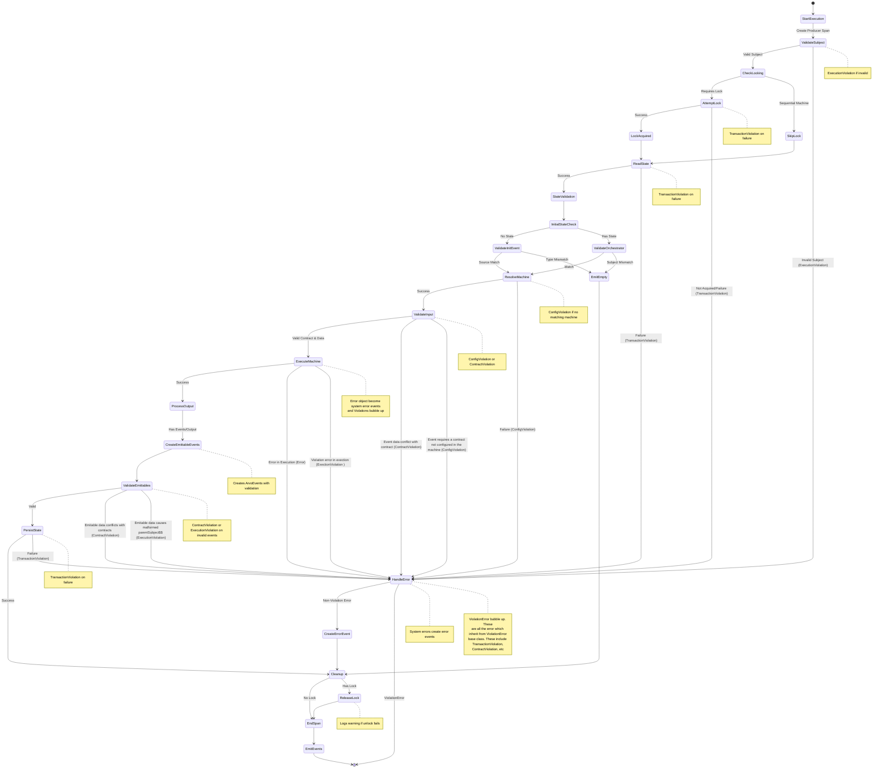
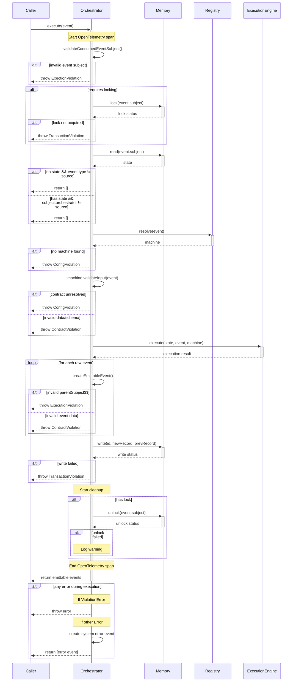

# ArvoOrchestrator Technical Documentation

This technical documentation provides a comprehensive overview of the ArvoOrchestrator's event processing system, illustrating both the state transitions and component interactions that occur during event execution. Through detailed state and sequence diagrams, engineers can trace how events flow through the handler, understand where and why different types of errors might occur, and identify the specific interactions between the Orchestrator, Memory, Registry, and ExecutionEngine components. The documentation maps out the complete lifecycle of event processing, from initial validation through lock management, state handling, and eventual event emission, with particular attention to error scenarios and their propagation paths. Engineers working with this handler can use these diagrams to understand the extensive validation checks, state management procedures, and error handling mechanisms that ensure reliable event processing. The documentation serves as both a reference for understanding normal operation flows and a troubleshooting guide for identifying where and why different types of errors might emerge during event processing, making it particularly valuable for engineers maintaining and debugging the handler in production environments.

## Execution Flow

The state diagram below illustrates the core execution flow:

## Component Interactions

The sequence diagram below shows the detailed interactions between components:

