# ArvoResumable Execution Flow

ArvoResumable provides stateful orchestration for distributed workflows with persistence, locking, and contract validation. This document details the execution flow for developers working with the system.

## Execution Flow

The state diagram below illustrates the core execution flow and decision points:

```mermaid
stateDiagram-v2
    [*] --> StartExecution : Event received
    StartExecution --> ValidateSubject : Create OpenTelemetry span
    ValidateSubject --> SubjectMismatch : Wrong orchestrator name
    ValidateSubject --> ResolveHandler : Subject valid
    SubjectMismatch --> ReturnEmpty : Log warning
    ReturnEmpty --> [*]
    ResolveHandler --> HandlerNotFound : No handler for version
    ResolveHandler --> ValidateInput : Handler found
    HandlerNotFound --> ThrowConfigViolation
    ThrowConfigViolation --> ErrorHandling
    ValidateInput --> ContractValidationFailed : Invalid contract/schema
    ValidateInput --> AcquireLock : Input valid
    ContractValidationFailed --> ErrorHandling
    AcquireLock --> LockNotAcquired : Lock unavailable
    AcquireLock --> AcquireState : Lock acquired/not required
    LockNotAcquired --> ThrowTransactionViolation
    ThrowTransactionViolation --> ErrorHandling
    AcquireState --> CheckStatus : State loaded/initialized
    CheckStatus --> WorkflowDone : status === 'done'
    CheckStatus --> ValidateInitEvent : status === 'active' or null
    WorkflowDone --> ReturnEmpty : Log terminal state
    ValidateInitEvent --> InvalidInitEvent : No state but wrong event type
    ValidateInitEvent --> ExecuteHandler : Valid init or resume
    InvalidInitEvent --> ReturnEmpty : Log invalid initialization
    ExecuteHandler --> ProcessResults : Handler execution complete
    ExecuteHandler --> HandlerError : Handler throws error
    HandlerError --> ErrorHandling
    ProcessResults --> CreateEvents : Process complete/service events
    CreateEvents --> EventCreationFailed : Schema validation fails
    CreateEvents --> PersistState : Events created successfully
    EventCreationFailed --> ErrorHandling
    PersistState --> ReleaseLock : State persisted
    ReleaseLock --> ReturnEvents : Lock released
    ReturnEvents --> [*] : Return domained events
    ErrorHandling --> ViolationError : Check error type
    ErrorHandling --> SystemError : Runtime/workflow error
    ViolationError --> RethrowError : ConfigViolation, etc.
    RethrowError --> [*]
    SystemError --> CreateSystemError : Create error event
    CreateSystemError --> ReleaseLock : System error created

    state CheckStatus {
        [*] --> StatusCheck
        StatusCheck --> Done : status === 'done'
        StatusCheck --> Active : status === 'active'
        StatusCheck --> New : status === null (new workflow)
        Done --> [*]
        Active --> [*]
        New --> [*]
    }

    state ProcessResults {
        [*] --> CheckComplete
        CheckComplete --> HasComplete : executionResult.complete exists
        CheckComplete --> NoComplete : no complete event
        HasComplete --> SetStatusDone : Mark workflow done
        NoComplete --> SetStatusActive : Keep workflow active
        SetStatusDone --> ProcessServices
        SetStatusActive --> ProcessServices
        ProcessServices --> [*]
    }

    state CreateEvents {
        [*] --> InitializeEventMaps : Create domains, emittables, eventIdMap
        InitializeEventMaps --> ProcessCompleteEvent : Has complete event
        InitializeEventMaps --> ProcessServiceEvents : No complete event
        
        ProcessCompleteEvent --> CreateCompleteEvent : executionResult.complete
        CreateCompleteEvent --> AddToEmittables : Complete event created
        AddToEmittables --> ProcessServiceEvents
        
        ProcessServiceEvents --> CheckServiceEvents : executionResult.services exists
        CheckServiceEvents --> CreateServiceEvent : For each service event
        CheckServiceEvents --> OrganizeByDomains : No service events
        
        CreateServiceEvent --> ValidateServiceContract : Resolve contract
        ValidateServiceContract --> CheckOrchestatorType : Contract found
        ValidateServiceContract --> EventValidationFailed : No contract
        
        CheckOrchestatorType --> HandleOrchestratorEvent : ArvoOrchestratorContract
        CheckOrchestatorType --> HandleRegularService : Regular service
        
        HandleOrchestratorEvent --> ValidateParentSubject : Check parentSubject$$
        ValidateParentSubject --> CreateOrchestratorSubject : Valid/missing parent
        ValidateParentSubject --> ParentSubjectError : Invalid parent
        
        CreateOrchestratorSubject --> CreateFromParent : parentSubject$$ exists
        CreateOrchestratorSubject --> CreateNew : No parentSubject$$
        CreateFromParent --> FinalizeServiceEvent
        CreateNew --> FinalizeServiceEvent
        
        HandleRegularService --> FinalizeServiceEvent
        
        FinalizeServiceEvent --> ValidateEventData : Schema validation
        ValidateEventData --> CreateArvoEvent : Data valid
        ValidateEventData --> SchemaValidationFailed : Invalid data
        
        CreateArvoEvent --> AddServiceToEmittables
        AddServiceToEmittables --> CheckMoreServices : More services to process
        CheckMoreServices --> CreateServiceEvent : Has more
        CheckMoreServices --> OrganizeByDomains : All processed
        
        OrganizeByDomains --> GroupByDomains : Organize events by domain tags
        GroupByDomains --> AddOtelAttributes : Set OpenTelemetry attributes
        AddOtelAttributes --> [*] : Events ready
        
        EventValidationFailed --> [*]
        ParentSubjectError --> [*]
        SchemaValidationFailed --> [*]
    }

    state ValidateInput {
        [*] --> ParseDataSchema : EventDataschemaUtil.parse()
        ParseDataSchema --> DataSchemaFailed : Parse failed
        ParseDataSchema --> ResolveContract : Schema parsed
        
        DataSchemaFailed --> [*]
        
        ResolveContract --> CheckSelfContract : event.type === self.type
        ResolveContract --> CheckServiceContracts : Different event type
        
        CheckSelfContract --> ValidateSelfContract : Is self contract
        CheckServiceContracts --> IterateServiceContracts : Check each service
        
        IterateServiceContracts --> CheckEmitTypes : Check emits + systemError
        CheckEmitTypes --> ContractFound : Type matches
        CheckEmitTypes --> CheckNextContract : No match
        CheckNextContract --> IterateServiceContracts : More contracts
        CheckNextContract --> NoContractFound : All checked
        
        ValidateSelfContract --> ValidateUriVersion : Contract resolved
        ContractFound --> ValidateUriVersion
        NoContractFound --> [*]
        
        ValidateUriVersion --> UriMismatch : URI doesn't match
        ValidateUriVersion --> CheckVersion : URI matches
        UriMismatch --> [*]
        
        CheckVersion --> VersionMismatch : Version mismatch
        CheckVersion --> ValidateSchema : Version matches/wildcard
        VersionMismatch --> [*]
        
        ValidateSchema --> SchemaValidationError : Zod validation fails
        ValidateSchema --> [*] : Validation success
        SchemaValidationError --> [*]
    }

    state CreateCompleteEvent {
        [*] --> SetCompletionContract : Use self contract
        SetCompletionContract --> SetCompletionSchema : Get complete event schema
        SetCompletionSchema --> SetCompletionSubject : Use parent or current subject
        SetCompletionSubject --> SetCompletionParentId : Use initEventId
        SetCompletionParentId --> SetCompletionTarget : Route to redirectto/initiator
        SetCompletionTarget --> [*] : Complete event configured
    }

    state PersistState {
        [*] --> CreateEventTracking : Build event tracking state
        CreateEventTracking --> UpdateConsumed : Set consumed event
        UpdateConsumed --> UpdateExpected : Create expected event map
        UpdateExpected --> UpdateProduced : Create produced event map
        UpdateProduced --> BuildNewState : Combine with handler state
        BuildNewState --> WriteToMemory : syncEventResource.persistState()
        WriteToMemory --> [*] : State persisted
    }

    state CreateSystemError {
        [*] --> ParseSubjectForError : Try to parse event subject
        ParseSubjectForError --> CreateErrorEvent : Subject parsed/failed
        CreateErrorEvent --> SetErrorTarget : Route to initiator/source
        SetErrorTarget --> SetErrorSubject : Use parent or current subject
        SetErrorSubject --> SetErrorParentId : Use initEventId or event.id
        SetErrorParentId --> AddErrorOtelAttributes : Set telemetry attributes
        AddErrorOtelAttributes --> [*] : System error ready
    }
```

## Component Interactions

The sequence diagram below shows the detailed interactions between components during event processing:

```mermaid
sequenceDiagram
    participant Client
    participant ArvoResumable as ArvoResumable
    participant OTel as OpenTelemetry
    participant SyncResource as SyncEventResource
    participant Memory as IMachineMemory
    participant Handler as UserHandler
    participant EventFactory as EventFactory

    Client->>ArvoResumable: execute(event, opentelemetry)
    
    ArvoResumable->>OTel: startActiveSpan()
    OTel-->>ArvoResumable: span created
    
    Note over ArvoResumable: Subject & Handler Resolution
    ArvoResumable->>ArvoResumable: validateEventSubject()
    ArvoResumable->>ArvoResumable: ArvoOrchestrationSubject.parse()
    
    alt Wrong orchestrator name
        ArvoResumable->>OTel: logToSpan(WARNING)
        ArvoResumable-->>Client: return empty events
    end
    
    alt Handler not found
        ArvoResumable->>ArvoResumable: throw ConfigViolation
    end
    
    Note over ArvoResumable: Input Validation
    ArvoResumable->>ArvoResumable: validateInput(event)
    ArvoResumable->>ArvoResumable: EventDataschemaUtil.parse()
    ArvoResumable->>ArvoResumable: resolve contract (self/service)
    ArvoResumable->>ArvoResumable: validate URI & version
    ArvoResumable->>ArvoResumable: schema.parse(event.data)
    
    alt Contract/Schema validation fails
        ArvoResumable->>ArvoResumable: throw ValidationError
    end
    
    Note over ArvoResumable: Resource Locking
    ArvoResumable->>SyncResource: acquireLock(event)
    SyncResource->>Memory: attempt lock acquisition
    Memory-->>SyncResource: lock status
    SyncResource-->>ArvoResumable: ACQUIRED/NOT_ACQUIRED/NOT_REQUIRED
    
    alt Lock not acquired
        ArvoResumable->>ArvoResumable: throw TransactionViolation
    end
    
    Note over ArvoResumable: State Management
    ArvoResumable->>SyncResource: acquireState(event)
    SyncResource->>Memory: read(event.subject)
    Memory-->>SyncResource: existing state or null
    SyncResource-->>ArvoResumable: workflow state
    
    alt Workflow already done
        ArvoResumable->>OTel: logToSpan(INFO - terminal state)
        ArvoResumable->>SyncResource: releaseLock()
        ArvoResumable-->>Client: return empty events
    end
    
    alt New workflow with wrong event type
        ArvoResumable->>OTel: logToSpan(WARNING - invalid init)
        ArvoResumable->>SyncResource: releaseLock()
        ArvoResumable-->>Client: return empty events
    end
    
    Note over ArvoResumable: Handler Execution
    ArvoResumable->>ArvoResumable: extract parentSubject from init event
    ArvoResumable->>ArvoResumable: update expected events tracking
    
    ArvoResumable->>Handler: handler({span, state, metadata, init, service, contracts})
    
    alt Handler execution fails
        Handler-->>ArvoResumable: throw Error
        ArvoResumable->>ArvoResumable: goto Error Handling
    end
    
    Handler-->>ArvoResumable: {state?, complete?, services?}
    
    Note over ArvoResumable: Event Creation & Processing
    loop For each result event (complete + services)
        alt Complete Event
            ArvoResumable->>ArvoResumable: create completion event
            ArvoResumable->>ArvoResumable: set subject = parentSubject ?? current
            ArvoResumable->>ArvoResumable: set parentId = initEventId
            ArvoResumable->>ArvoResumable: set target = redirectto ?? initiator
        else Service Event
            ArvoResumable->>ArvoResumable: resolve service contract
            
            alt Orchestrator Contract
                ArvoResumable->>ArvoResumable: validate parentSubject$$
                ArvoResumable->>ArvoResumable: ArvoOrchestrationSubject.from/new()
            end
            
            ArvoResumable->>ArvoResumable: validate event data against schema
        end
        
        ArvoResumable->>EventFactory: createArvoEvent(eventParams)
        EventFactory-->>ArvoResumable: created event
        
        ArvoResumable->>ArvoResumable: organize by domains
        ArvoResumable->>OTel: setAttribute(event telemetry)
    end
    
    Note over ArvoResumable: State Persistence
    ArvoResumable->>ArvoResumable: build event tracking state
    ArvoResumable->>ArvoResumable: determine status (complete ? 'done' : 'active')
    
    ArvoResumable->>SyncResource: persistState(event, newState, oldState, span)
    SyncResource->>Memory: write(subject, state)
    Memory-->>SyncResource: write success
    SyncResource-->>ArvoResumable: persistence complete
    
    ArvoResumable->>OTel: logToSpan(INFO - execution complete)
    
    Note over ArvoResumable: Cleanup & Return
    ArvoResumable->>SyncResource: releaseLock(event, acquiredLock, span)
    SyncResource->>Memory: release lock if acquired
    ArvoResumable->>OTel: span.end()
    
    ArvoResumable-->>Client: {events, allEventDomains, domainedEvents}

    Note over ArvoResumable: Error Handling Path
    rect rgb(255, 200, 200)
        alt ViolationError (Config/Contract/Execution)
            ArvoResumable->>OTel: logToSpan(CRITICAL)
            ArvoResumable->>OTel: exceptionToSpan(error)
            ArvoResumable->>SyncResource: releaseLock()
            ArvoResumable->>ArvoResumable: throw error (rethrow)
        else Runtime/Workflow Error
            ArvoResumable->>OTel: logToSpan(ERROR)
            ArvoResumable->>OTel: exceptionToSpan(error)
            
            ArvoResumable->>ArvoResumable: parse event subject for routing
            ArvoResumable->>EventFactory: createSystemError({source, subject, to, error, ...})
            EventFactory-->>ArvoResumable: system error event
            
            ArvoResumable->>OTel: setAttribute(error event telemetry)
            ArvoResumable->>SyncResource: releaseLock()
            ArvoResumable-->>Client: {events: [errorEvent], domains: ['default']}
        end
    end
```

