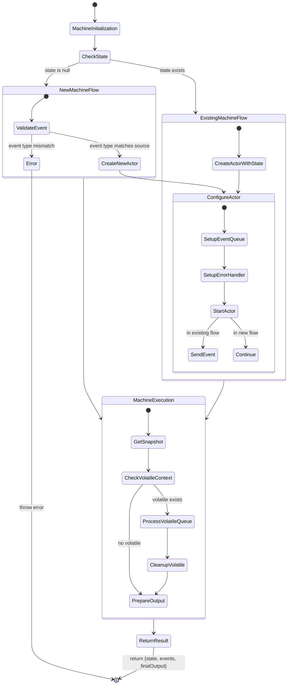
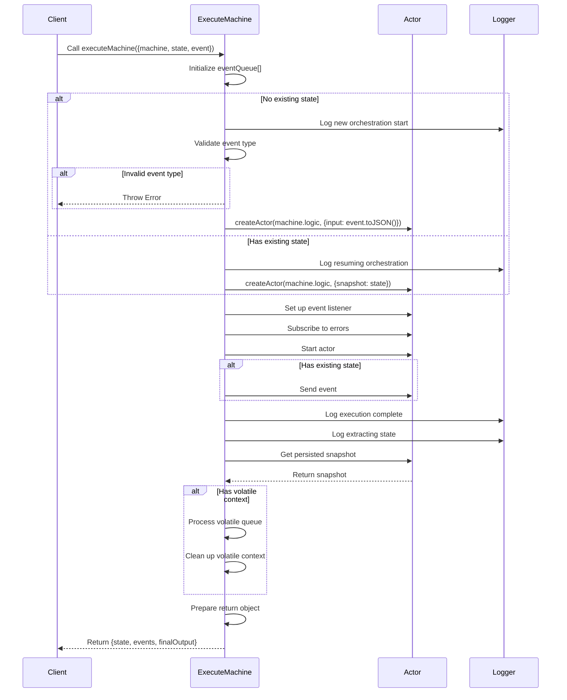

# Execution Diagrams for `executeMachine`

The state diagram illustrates the execution flow of the executeMachine function, showing the primary paths for both new and existing machine states. It begins with machine initialization, branches based on state existence, and proceeds through configuration and execution phases before ultimately returning the final state and events. The diagram highlights key decision points, error handling paths, and the processing of volatile contexts, providing a clear visualization of the function's state transitions and logic flow.

The sequence diagram details the temporal interactions between the client, execution machine, actor, and logger components. It demonstrates the chronological flow of operations, including initialization, state validation, actor creation and configuration, event processing, and final state preparation. This representation is particularly useful for understanding the timing and dependencies of operations, as well as the communication patterns between different parts of the system during machine execution.

